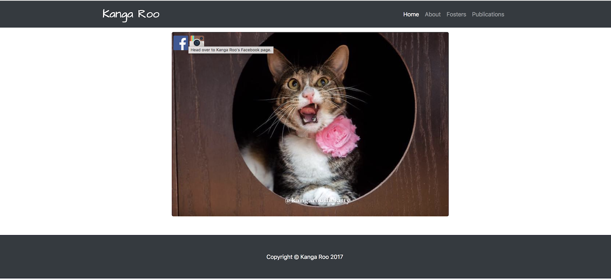

# KangaRoo



## What Is It?
A Bootstrap based web site for Kanga Roo the cat and her fosters.  Kanga Roo is a rescued cat from Saving Grace Rescue, check her out on Facebook [Kanga Roo](https://www.facebook.com/KangaRooTheKitty/)

## How Do I Access the Page?
1. The page is hosted on GitHub Pages, click [HERE](https://xtiane.github.io/KangaRoo/) to check it out.
2. You can clone this repository to your local environment and then launch the ```index.html``` page on your browser.

## Under The Hood?
This web site was created using Bootstrap.
